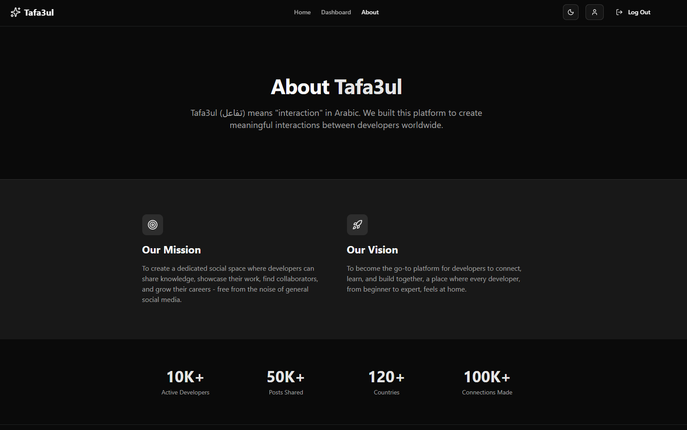

# Tafa3ul

Tafa3ul is a social media app built for developers to share posts, showcase their profiles, and connect with peers.



## Features

- Authentication with JWT access + refresh tokens
- Developer profiles with bio, socials, skills, experience, and education
- Public app users with search and pagination
- Feed with posts, images, likes, comments and infinite scroll
- Post and profile search (server-backed)
- Role-based authorization
- Responsive UI with light/dark mode support

## Tech Stack

### Frontend

- React 19 + TypeScript
- Bun v1.3
- Vite v7
- Tailwind CSS and Shadcn UI
- TanStack Query v5
- React Router v7
- Zustand for state management
- React Hook Form with Zod validation
- Axios, Sonner, Lucide + React Icons

### Backend

- .NET 10 (ASP.NET Core Web API)
- Entity Framework Core 10
- PostgreSQL (Npgsql)
- JWT auth (access + refresh tokens)
- Scalar OpenAPI (dev-time API docs)
- ImageSharp (image processing)

## Project Structure

```
.
├─ client/                 # React frontend
├─ server/                 # .NET backend
│  ├─ Tafa3ul.Api/         # Web API
│  ├─ Tafa3ul.Core/        # Business logic
│  ├─ Tafa3ul.Data/        # EF Core + migrations
│  └─ Tafa3ul.Domain/      # Domain models + DTOs
└─ showcase/               # Screenshots
```

## Environment Variables

### Client (`client/.env`)

- `VITE_BASE_URL`: Base URL of the backend (used for absolute links)
- `VITE_API_BASE_URL`: API base path for HTTP calls
- `VITE_PROFILE_PIC_BASE_URL`: Static profile image base URL

### Server (`server/Tafa3ul.Api/appsettings.json`)

- `ConnectionStrings:DefaultConnection`: PostgreSQL connection string
- `Jwt:Key`, `Jwt:Issuer`, `Jwt:Audience`, `Jwt:ExpirationMinutes`, `Jwt:RefreshTokenExpirationDays`

## API Overview

The API is organized around three main areas:

- Auth: register, login, refresh token, logout, role-protected endpoints
- Profiles: create/update profile, upload avatar, add skills/experience/education, user lookup, list/search profiles
- Posts: create posts (with images), list/search posts, like/unlike, add/delete comments

## Scripts

### Frontend (client)

- `dev`: Start Vite dev server
- `build`: Type-check + production build
- `lint`: ESLint
- `preview`: Preview production build

## Notes

- CORS is configured for `http://localhost:5173` and `https://localhost:5173` in development.
- OpenAPI + Scalar docs are enabled in development builds of the API.
